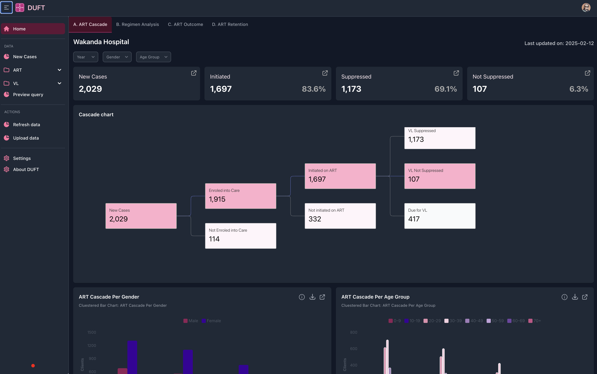

<div align="center">
  <h1>DUFT UI</h1>
  <p></p>
</div>
<div align="center">
  <a href="https://flowbite-react-admin-dashboard.vercel.app/">
    
  </a>
  <br />
</div>
<hr />

**You can [copy/paste code you want from this project](#how-to-use-in-your-own-project), or [use the whole thing for your website](#how-to-install).**

## Table of Contents

- [How to install](#how-to-install)
  - [Assumptions](#assumptions)
- [How to develop locally](#how-to-develop-locally)
- [How to build for production](#how-to-build-for-production)
- [How to deploy](#how-to-deploy)

## How to install

### Assumptions

- You can open a shell/terminal/command prompt
- You have `git` instaslled and can run `git` in the shell
- You have `nodejs` installed and can run `node`, `npm` in the shell

Install [`yarn`](https://yarnpkg.com/)

```sh
npm i -g yarn
```

Clone this repository

```sh
git clone https://github.com/UCSF-IGHS/duft-ui
cd duft-ui
```

Install dependencies for this project

```sh
yarn install
```

## How to develop locally

Once run, this command will display a link to the local server.

```sh
yarn dev
```

## How to build for production

Your code won't build if you have TypeScript errors. Otherwise, the command will report how large the output files are, which should go to `dist` folder.

We use [vite](https://vitejs.dev) to build and its default behavior is to emit an `index.html`, `app.js`, and `app.css`.

```sh
yarn build
```

## How to deploy

You can deploy this repository to any hosting service from Cloudflare Pages, Vercel, or Github Pages to Heroku to AWS to your own Nginx server.

However, `react-router` needs your server to send all requests to `/`. This is commonly referred to as a [Single Page Application (SPA)](https://developer.mozilla.org/en-US/docs/Glossary/SPA). You will have to add a rewrite to accomplish that. To host on Vercel, for example, you just need to add a `vercel.json` with:

```json
{
  "routes": [
    {
      "src": "/[^.]+",
      "dest": "/",
      "status": 200
    }
  ]
}
```

Most, but not all, providers have a mechanism to do this, but we can't cover them all here.

Alternatively, you can change this app to server-side render. `vite` isn't designed to do that, so you'll need to use a plugin to create an HTML file for each page. `vite` [has a section in their docs](https://github.com/vitejs/awesome-vite#ssr) about SSR plugins and they seem great.
